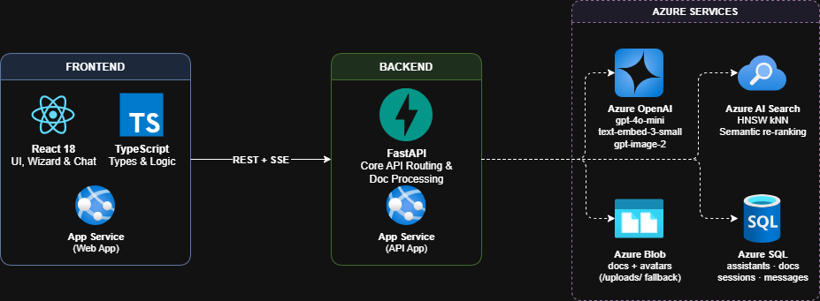

# Lincite — Multi-Assistant RAG Platform

A full-stack Retrieval-Augmented Generation platform where each AI assistant owns an isolated knowledge base. Upload documents, chat with grounded answers and grouped source citations, manage multiple specialised assistants, and deploy to Azure App Service in one push.



---

## Features

- **Multi-assistant workspace** — create, edit, clone, pin, export, and import assistants
- **5-step creation wizard** — name, instructions (presets + snippets), avatar, knowledge base, review
- **Isolated knowledge bases** — each assistant's documents are completely separated via `assistant_id` OData filters in Azure AI Search
- **Streaming chat** — token-by-token responses via Server-Sent Events
- **Grounded citations** — grouped source pills with one-click snippet preview
- **Conversation management** — multiple sessions per assistant, rename, branch, regenerate, export as `.md` / `.pdf`
- **Message feedback** — thumbs-up / thumbs-down stored per message
- **AI avatar generation** — `gpt-image-2` generates a prompt-based icon; stored in Azure Blob Storage
- **ZIP export / import** — bundle an assistant (instructions + documents + avatar) into a portable `.zip`
- **Bilingual UI** — full EN / ES localisation
- **Dual Pantone theme** — cool Cerulean blue-gray (light) / warm greige (dark)
- **CI/CD** — GitHub Actions deploys to Azure App Service on every push to `main`

---

## Tech Stack

| Layer | Technology |
|---|---|
| Frontend | React 18, TypeScript, Vite 5, Tailwind CSS v3 |
| Backend | Python 3.14, FastAPI, SQLAlchemy 2 |
| Database | Azure SQL via `pymssql` (falls back to SQLite locally) |
| File storage | Azure Blob Storage (falls back to local `uploads/`) |
| Vector search | Azure AI Search — HNSW + hybrid + semantic ranking |
| LLM / Embeddings | Azure OpenAI `gpt-4o-mini` + `text-embedding-3-small` |
| Image generation | Azure OpenAI `gpt-image-2` |
| Document parsing | PyMuPDF, python-docx, python-pptx, pytesseract + Pillow (OCR) |

---

## Prerequisites

- Python 3.14+
- Node.js 20+
- Tesseract-OCR installed on the system (required for image file parsing)
- Azure account with the following resources provisioned:
  - Azure OpenAI (deployments: `gpt-4o-mini`, `text-embedding-3-small`, `gpt-image-2`)
  - Azure AI Search (Basic tier with semantic ranker enabled)
  - Azure SQL Database
  - Azure Blob Storage

---

## Local Setup

### 1. Environment variables

```bash
cp .env.example .env
```

Fill in all values in `.env`. Azure SQL and Blob Storage are optional for local development — the app falls back to SQLite and a local `uploads/` directory when those vars are absent.

### 2. Backend

```bash
pip install -r requirements.txt
uvicorn backend.main:app --reload --port 8000
```

### 3. Frontend

```bash
cd frontend
npm install
npm run dev        # Vite dev server on :3000, proxies /api/* → :8000
```

Open [http://localhost:3000](http://localhost:3000).

---

## Deployment (Azure App Service + GitHub Actions)

The repository includes a pre-configured workflow at `.github/workflows/main_lincite.yml`.

On every push to `main`:
1. Node 20 builds the React SPA (`npm ci && npm run build`)
2. Python 3.14 installs dependencies into a venv
3. The artifact (including `frontend/dist`) is uploaded
4. OIDC federated credentials authenticate to Azure — no stored secrets
5. `azure/webapps-deploy@v3` pushes to the `lincite` App Service slot `Production`
6. Oryx activates the venv and starts Uvicorn; FastAPI serves the SPA and handles routing

To connect your own App Service, replace the three secret references in the workflow (`AZUREAPPSERVICE_CLIENTID_*`, `AZUREAPPSERVICE_TENANTID_*`, `AZUREAPPSERVICE_SUBSCRIPTIONID_*`) and the `app-name` field with your resource details.

---

## Environment Variables

| Variable | Required | Description |
|---|---|---|
| `AZURE_OPENAI_API_KEY` | Yes | Azure OpenAI auth key |
| `AZURE_OPENAI_ENDPOINT` | Yes | Azure OpenAI resource endpoint |
| `AZURE_OPENAI_API_VERSION` | Yes | API version (e.g. `2024-02-15-preview`) |
| `AZURE_OPENAI_CHAT_DEPLOYMENT` | Yes | Chat model (e.g. `gpt-4o-mini`) |
| `AZURE_OPENAI_EMBEDDING_DEPLOYMENT` | Yes | Embedding model (e.g. `text-embedding-3-small`) |
| `AZURE_OPENAI_IMAGE_DEPLOYMENT` | Yes | Image model (e.g. `gpt-image-2`) |
| `AZURE_SEARCH_SERVICE_ENDPOINT` | Yes | Azure AI Search endpoint URL |
| `AZURE_SEARCH_ADMIN_KEY` | Yes | Azure AI Search admin key |
| `AZURE_SEARCH_INDEX_NAME` | Yes | Search index name |
| `AZURE_SQL_CONNECTION_STRING` | No | Azure SQL connection string; omit to use local SQLite |
| `AZURE_STORAGE_CONNECTION_STRING` | No | Blob Storage connection string; omit to use local `uploads/` |
| `AZURE_STORAGE_DOCUMENTS_CONTAINER` | No | Blob container for documents (default: `documents`) |
| `AZURE_STORAGE_AVATARS_CONTAINER` | No | Blob container for avatars (default: `avatars`) |

---

## Supported Document Formats

| Format | Parser |
|---|---|
| PDF | PyMuPDF |
| DOCX | python-docx |
| PPTX | python-pptx |
| TXT / MD / CSV | plain-text read |
| PNG / JPG / BMP | Pillow + pytesseract (local OCR) |

---

## Data Reset

To wipe all data from Azure SQL, Azure AI Search, and Blob Storage:

```bash
python scripts/reset_data.py
```

Requires the venv to be active and `.env` to be populated.

---

## Architecture

See [ARCHITECTURE.md](ARCHITECTURE.md) for detailed workflows, data model, API surface, and design decisions.
